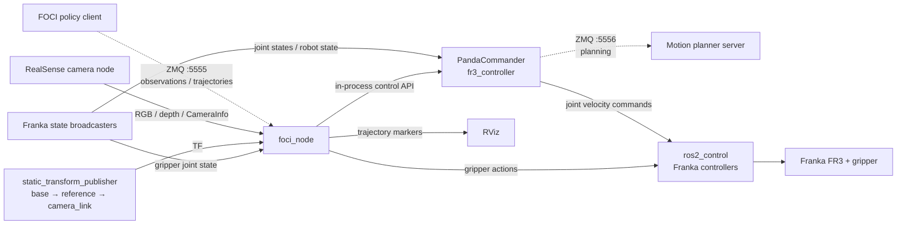

# FOCI ROS 2 workspace

ROS 2 Humble workspace for running the FOCI policy on a Franka FR3 with an
Intel RealSense camera.

## Prerequisites

- Ubuntu 22.04 and ROS 2 Humble
- [franka_ros2](https://github.com/frankarobotics/franka_ros2)
- [realsense-ros](https://github.com/IntelRealSense/realsense-ros)
- `colcon`, MoveIt 2, OpenCV, ZMQ and the Python dependencies imported by
  `foci_policy`

## Build

```bash
# clone this repo
cd foci_ros2_ws
rosdep install --from-paths src --ignore-src -r -y
colcon build --symlink-install
source install/setup.bash
```

## Configuration

Edit YAML files before running on your own system:

- `src/foci_policy/config/foci.yaml`: RealSense serial/profile, camera TF,
  frame names, topics, ZMQ endpoints and point-cloud parameters.
- `src/demo_collection/config/demo_collection.yaml`: RealSense and camera TF
  settings, recording topics/rates and dataset output paths.
- `src/franka_fr3_moveit_config/config/deployment.yaml`: robot IP and fake
  hardware options.

Because `colcon build --symlink-install` is used, source-space edits are normally visible immediately; rebuild if the installed copy is not a symlink.

## Run

Bring up the robot using `config/deployment.yaml`:

```bash
ros2 launch franka_fr3_moveit_config full_launch.launch.py
```

Start FOCI in another sourced terminal:

```bash
ros2 launch foci_policy foci.launch.py
```

## Node architecture

The main runtime data flow is shown below. Solid arrows represent ROS 2
topics, actions, or TF data; dashed arrows represent ZMQ communication.



For demonstration collection, `keyboard_publisher` and `joystick_publisher`
publish `/demo_commands`. `demo_recorder` or `video_recorder` combines those
commands with synchronized RealSense data, robot/gripper state, and TF, then
writes the configured dataset directory.

## Camera calibration guide

The experimental setup uses a fixed external camera. Camera intrinsics are read
at runtime from `/camera/color/camera_info`, so intrinsic matrices do not need
to be copied into the source code or configuration files. Camera extrinsics are
obtained from the TF tree.

The launch files publish the two deployment-specific static transforms below:

```text
fr3_link0 -> ref_frame -> camera_link
```

Recommended calibration procedure:

1. Follow
   [franka_handeye_calibration_ros2](https://github.com/ChengYaofeng/franka_handeye_calibration_ros2)
   to create a calibration workspace and prepare an ArUco marker. Use the
   eye-to-hand procedure because the camera is fixed outside the robot.
2. Run the calibration and record the resulting transform between the robot
   base and the calibrated camera frame. Confirm the transform direction and
   quaternion convention before copying any values.
3. Express the calibrated result using `base_to_reference` and
   `reference_to_camera` under `transforms` in both
   `src/foci_policy/config/foci.yaml` and
   `src/demo_collection/config/demo_collection.yaml`. Translation values are in
   metres, and quaternions use `[x, y, z, w]` order.
4. Start the camera and verify that it publishes valid intrinsics on
   `/camera/color/camera_info`. The RealSense driver also publishes the internal
   transform from `camera_link` to `camera_color_optical_frame`; do not replace
   this factory transform with the hand-eye result.
5. Launch the system and verify the complete TF chain in RViz. A point observed
   in the camera image should align with the same physical location in the
   `fr3_link0` frame. Repeat the calibration if the translation, orientation,
   or frame direction is inconsistent.

If different frame names or camera topics are used, update the `frames` and
`ros__parameters` sections in both configuration files as well.

## Demonstration collection

First edit `demo_collection.yaml`, especially `output_dir`, camera serial and
calibration. Then run:

```bash
ros2 launch demo_collection demo_recorder.launch.py

# or for video recording only:
ros2 launch demo_collection video_recorder.launch.py
```

Recorder topics and sampling parameters are in the `demo_recorder` and
`video_recorder` sections. Camera intrinsics and extrinsics are saved from
`CameraInfo` and TF into each recording directory.

Commands are published on `/demo_commands`: `r` starts recording, `s` stops,
and the full demo recorder additionally supports `g` (toggle gripper) and `q`
(quit).
